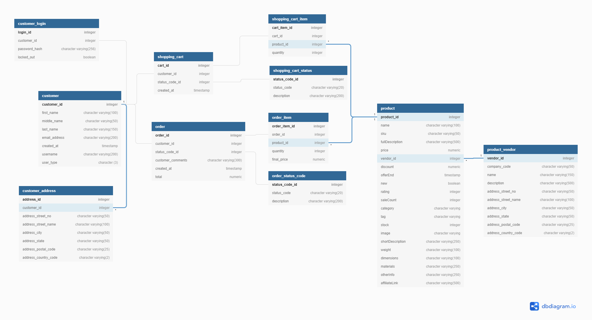

# The E-Commerce Backend (REST API)

> The E-Commerce Backend is a fully-functioning REST API that allows users to perform various CRUD operations such as registering an account, browsing products for sale, etc.

## Table of contents

* [General info](#general-info)
* [Screenshots](#screenshots)
* [Technologies](#technologies)
* [Setup](#setup)
* [Features](#features)
* [Status](#status)
* [Inspiration](#inspiration)
* [Contact](#contact)

## General info

The purpose of this project is to help me to better understand Node.js, Express.js, postgreSQL, Passport, Swagger and to inspire people with valuable code.

## Screenshots



## Technologies

* Express - version 4.16.1
* Express pg - version 8.5.1
* Express session - version 1.17.1
* Express validator - version 6.10.0
* Passport - version 0.4.1
* Passport-local - version 1.0.0
* Bcrypt - version 5.0.1
* Cors - version 2.8.5
* PostgreSQL - version 13
* Swagger-jsdoc - version 6.0.0

## Setup

Please use npm install & npm start to run the application in your local environment and use the shopDB.sql file to create your own database.

## Code Examples

Examples of API configuration:

```javascript

/*__________Passport middlewares___________*/
const passport = require("passport");
const LocalStrategy = require("passport-local");
const AuthService = require("./services/AuthService.js");

// Initialize passport
app.use(passport.initialize());
app.use(passport.session());

// Set method to serialize data to store in cookie
passport.serializeUser((user, done) => {
  done(null, user.customer_id);
});

// Set method to deserialize data stored in cookie and attach to req.user
passport.deserializeUser((id, done) => {
  done(null, { id });
});

// Configure local strategy to be use for local login
passport.use(
  new LocalStrategy(async (username, password, done) => {
    try {
      const user = await AuthService.login({
        username: username,
        password: password,
      });
      return done(null, user);
    } catch (err) {
      return done(err);
    }
  })
);

/*__________API route handler______________*/
const indexRouter = require("./routes/index");
const authRouter = require("./routes/auth");
const customerRouter = require("./routes/customer");
const productRouter = require("./routes/product");
const cartRouter = require("./routes/cart");
const orderRouter = require("./routes/order");

app.use("/", indexRouter);
app.use("/auth", authRouter);
app.use("/customers", customerRouter);
app.use("/products", productRouter);
app.use("/carts", cartRouter);
app.use("/orders", orderRouter);

```

## Features

List of features ready and TODOs for future development

* Register and log in via local login
* CRUD operations on products
* CRUD operations on shopping carts
* Place an order
* CRUD operations on orders
* Swagger documention of the Order & Product API

To-do list:

* Extend Swagger documentation for Auth & Cart API
* CRUD operations on user accounts
* 3rd party login via Google and Amazon
* Process payments via Stripe and Paypal
* Deploy API to Heroku

## Status

Project is: _wip_

## Inspiration

Thanks to Codecademy for providing inspiring content.

## Contact

Created by [@pwagnerde](https://www.linkedin.com/in/pwagnerde/) - feel free to contact me!
